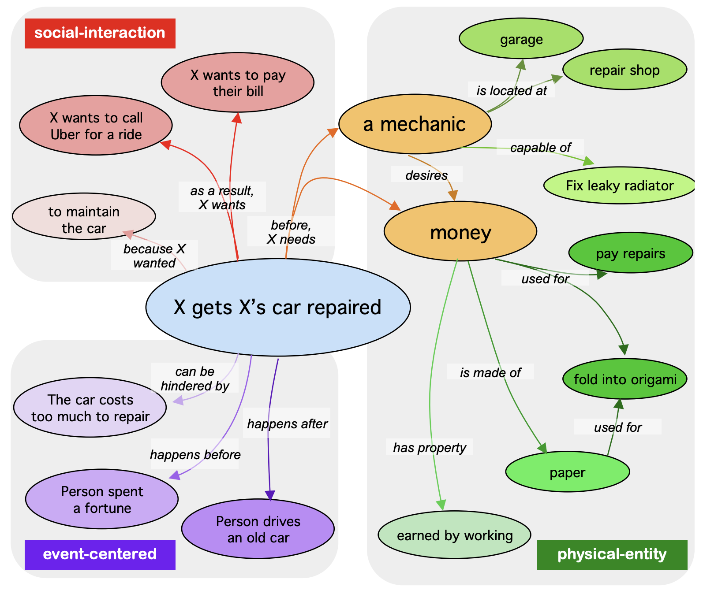

# (Comet-) ATOMIC 2020: On Symbolic and Neural Commonsense Knowledge Graphs

## Paper
Jena D. Hwang, Chandra Bhagavatula, Ronan Le Bras, Jeff Da, Keisuke Sakaguchi, Antoine Bosselut, Yejin Choi\
["(Comet-) Atomic 2020: On Symbolic and Neural Commonsense Knowledge Graphs."](https://arxiv.org/abs/2010.05953) \
Appearing at AAAI Conference on Artificial Intelligence 2021

## Data

The data for ATOMIC 2020 is available [here](https://allenai.org/data/atomic-2020). If you need the ATOMIC 2018 data ( [Sap et al. 2018](https://arxiv.org/abs/1811.00146) ) it is downloadable [here](https://allenai.org/data/atomic).

## COMET

Trained COMET model can be downloaded [here](https://storage.googleapis.com/ai2-mosaic-public/projects/mosaic-kgs/comet-atomic_2020_BART.zip).

## Codebase

We include code used in expirements in COMET-ATOMIC2020 for reproducibility, ease of use. Our models are based off the [HuggingFace Transformers](https://huggingface.co/) codebase, with minor adjustments to adapt the model for our data. Details can be found in the AAAI paper.

### Setup

Run `pip install -r requirements.txt` to install requirements for your Python instance. We recommend [Conda](https://www.anaconda.com/) to manage Python installs. Our codebases is on Python 3.

It's recommended that you test that your enviroment is set up correctly before running modeling code. You can do this via `python models/comet_atomic2020_gpt2/comet_gpt2.py --test_install`

The code for modeling is located in `mosaic/infra/modeling`. `mosaic/datasets/KGDataset` is used to convert the ATOMIC2020 CSV into an HuggingFace `Datasets` object.

### Directory Overview

`beaker_exp`: Contains files needed to run expirements using `Beaker` (https://beaker.org/) instead of on your local machine.

`human_eval`: Contains HTML files for human evaluation on Amazon MTurk, as described in the AAAI paper.

`models`: Contains additional modeling files to reproduce the GPT2 and BART expirements. `models/comet_atomic2020_bart` contains a README and code to run COMET-BART2020.

`scripts`: Contains additional scripts (e.g. utils.py) used during expirements in the COMET-ATOMIC2020 paper.

`split`: Contains code used to make the test, train, and dev splits of ATOMIC2020 with Stratified Random Sampling.

`system_eval`: Contains code for automatic evaluation of generated entities.

## Contributions

We welcome contributions to the codebase of COMET-2020. We encourage pull requests instead of issues; and suggest filing a GitHub issue with questions / suggestions.

## License
COMET-ATOMIC 2020 (codebase) is licensed under the Apache License 2.0. The ATOMIC 2020 dataset is licensed under CC-BY.

## Contact
Email: jenah[at]allenai[dot]org
